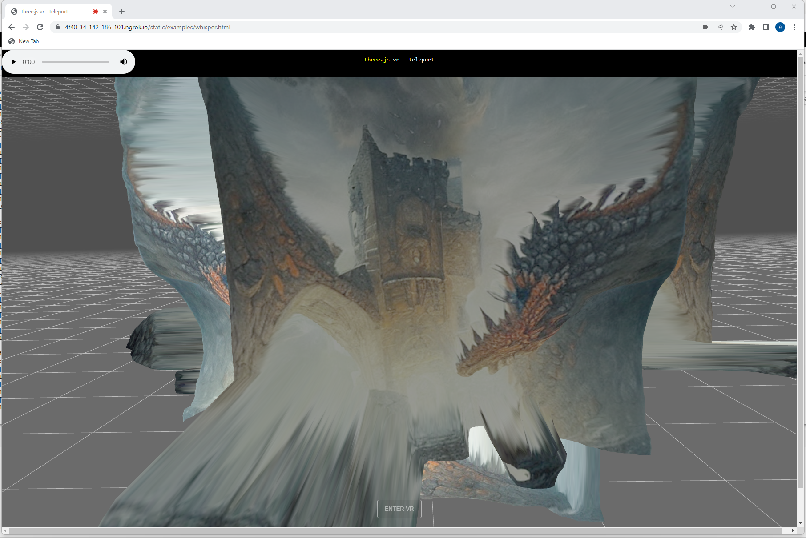

# StableCraft

Currently this is just a VR viewer for StableDiffusion outputs, but I'm planning to make it
into a fully fledged RPG maker

When in VR, press "A" button on your controller to record audio.
1. this is convered using OpenAI's whisper into a text prompt
2. this text prompt is rendered using StableDiffusion
3. a depth map is generated using DPT
4. and that is all rendered back for you in VR

To run, you need to start the server: flask_app.py and then go to the page <server>/static/examples/whisper.html

The easiest way is probably just with [colab](https://colab.research.google.com/github/nagolinc/StableCraft/blob/main/StableCraft.ipynb)

Check out the [demo](https://nagolinc.github.io/StableCraft/sampleProject/examples/whisper.html)
